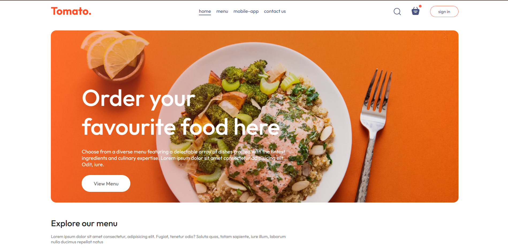
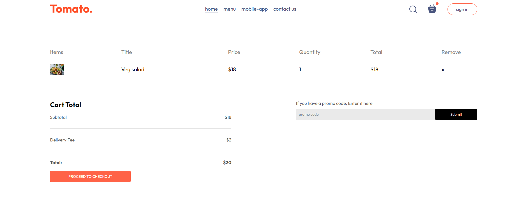

# Info

This is a e-commerce website. Here we design the frontend of this Website by using React Libary

# Configuration

In terminal write those command

- For installing dependencies: npm i
- For runing the website: npm run dev

# Website

Mobile responsive:

Home Page:

Cart Page:

